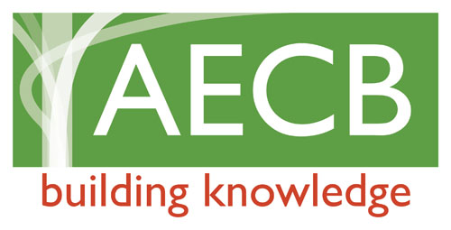

```{r setup, include=FALSE}
knitr::opts_chunk$set(echo = FALSE)
```

It is never too early in a project's life cycle to get in touch with us for a chat. We can even help you get the right architect on board if you need!  

Drop us a line at [dudley.retrofits@gmail.com](mailto:dudley.retrofits@gmail.com) to get a conversation started.

[](images/aecb.jpeg)
